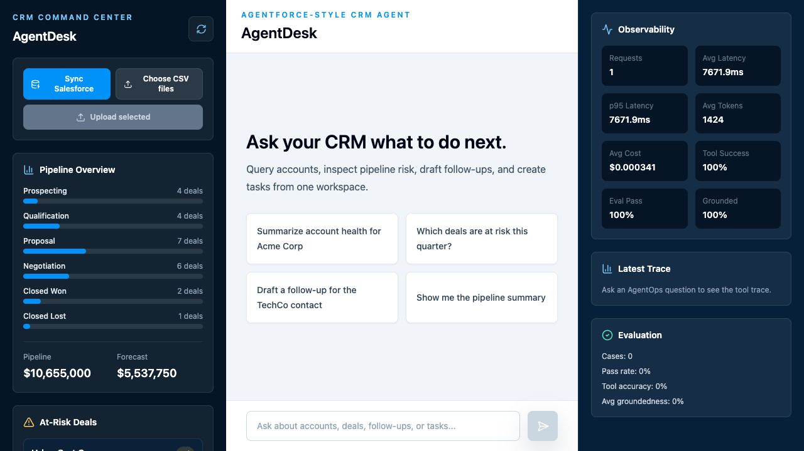

# AgentDesk Enterprise AgentOps


AgentDesk Enterprise AgentOps is a full-stack GenAI CRM copilot for sales teams. It lets users ask CRM questions in natural language, routes each request through a LangGraph workflow, calls safe CRM tools, returns grounded answers, and tracks production-style metrics such as latency, tool success, token usage, estimated cost, and groundedness.

The project is built as an Agentforce-style multi-tool LLM agent with an AgentOps layer. Salesforce-style CRM data is synced into a SQLite cache, the official MCP Python SDK exposes CRM actions over Streamable HTTP, and the frontend shows chat, tool traces, observability metrics, and evaluation results.

## Architecture

```text
Sales Rep
   |
   v
React + TypeScript + Tailwind frontend
   |
   |  /api/chat, /api/pipeline, /api/accounts, /api/deals/at-risk
   v
FastAPI backend
   |
   +--> Official MCP server at /mcp
   |
   +--> LangGraph agent + deterministic CRM tools
   |
   +--> SQLite CRM tables
   |      accounts, contacts, opportunities, tasks, activities
   |
   +--> OpenAI chat model
          configured with OPENAI_MODEL
```

## AgentOps Capabilities

- LangGraph workflow: router, CRM tool execution, answer generation, evaluation guardrail.
- Official MCP Python SDK server: `POST /mcp` or `/mcp/` exposes CRM tools over Streamable HTTP.
- Compatibility tool registry: `GET /api/tools` exposes tool names, descriptions, and JSON schemas.
- CRM tools: pipeline health, at-risk deals, account summary, follow-up drafting, task creation, revenue forecasting, stale opportunities, high-revenue low-activity accounts.
- Observability: request count, average latency, p95 latency, tokens/request, estimated cost/request, tool success rate, failed tool calls, evaluation pass rate, groundedness score.
- Evaluation: JSONL cases in `backend/evals/eval_cases.jsonl`; runner at `backend/evals/run_eval.py`.

## Setup

### Backend

```bash
cd agentdesk
cp .env.example .env
# add OPENAI_API_KEY to .env
# optionally set OPENAI_MODEL, defaults to gpt-4o-mini

cd backend
python -m venv .venv
source .venv/bin/activate
pip install -r requirements.txt
python database.py
uvicorn main:app --reload --port 8000
```

The standalone seed command recreates `backend/agentdesk.db` with 20 accounts, 24 contacts, 24 opportunities, and 24 tasks.

### Frontend

```bash
cd agentdesk/frontend
npm install
npm run dev
```

Open `http://localhost:3000`. The Vite dev server proxies `/api/*` calls to `http://localhost:8000`.

## AgentOps API

```text
POST /chat
GET /metrics
GET /traces/recent
GET /eval/results
POST /eval/run
GET /mcp/tools
POST /mcp/tools/{tool_name}
GET /crm/accounts
GET /crm/opportunities
POST /mcp
```

The React production build is served by FastAPI from the same service, so the Cloud Run demo uses one public URL for the frontend, backend, and MCP endpoint.

Run the eval set:

```bash
cd agentdesk/backend
source .venv/bin/activate
python -m evals.run_eval
```

## Official MCP Server

AgentDesk uses the official MCP Python SDK:

```python
from mcp.server.fastmcp import FastMCP
```

The MCP server is mounted into FastAPI at:

```text
http://localhost:8000/mcp
```

It exposes these typed CRM tools:

- `get_pipeline_health`
- `find_at_risk_deals`
- `summarize_account`
- `draft_follow_up`
- `create_task`
- `forecast_revenue`

You can test it with MCP Inspector:

```bash
npx @modelcontextprotocol/inspector http://localhost:8000/mcp
```

## Cloud Run Deployment

The root `Dockerfile` builds the React frontend and FastAPI backend into one Cloud Run service.

Deployment defaults:

```text
Service: agentdesk-agentops
Region: us-central1
Secret Manager key: agentdesk-openai-api-key
MCP endpoint: https://YOUR_CLOUD_RUN_URL/mcp
```

Install and authenticate Google Cloud CLI, then run:

```bash
gcloud config set project YOUR_PROJECT_ID

gcloud services enable \
  run.googleapis.com \
  cloudbuild.googleapis.com \
  artifactregistry.googleapis.com \
  secretmanager.googleapis.com

gcloud artifacts repositories create agentdesk \
  --repository-format=docker \
  --location=us-central1

gcloud secrets create agentdesk-openai-api-key \
  --replication-policy=automatic

printf "YOUR_OPENAI_API_KEY" | gcloud secrets versions add agentdesk-openai-api-key --data-file=-

gcloud builds submit \
  --tag us-central1-docker.pkg.dev/YOUR_PROJECT_ID/agentdesk/agentdesk-agentops:latest

gcloud run deploy agentdesk-agentops \
  --image us-central1-docker.pkg.dev/YOUR_PROJECT_ID/agentdesk/agentdesk-agentops:latest \
  --platform managed \
  --region us-central1 \
  --allow-unauthenticated \
  --set-secrets OPENAI_API_KEY=agentdesk-openai-api-key:latest \
  --set-env-vars OPENAI_MODEL=gpt-4o-mini
```

Live demo URL:

```text
https://agentdesk-agentops-278905193417.us-central1.run.app
```

MCP endpoint:

```text
https://agentdesk-agentops-278905193417.us-central1.run.app/mcp
```

## CRM Agent Tools

AgentDesk exposes five LangChain tools to the agent:

- `get_account_summary(account_name)` fuzzy-searches accounts and returns account health, open opportunities, and last contact date.
- `get_at_risk_deals()` ranks open deals closing within 30 days with probability below 50%.
- `draft_followup_email(contact_id, context)` drafts a warm professional follow-up using OpenAI and CRM context.
- `create_task(contact_id, title, due_days)` creates an open CRM task.
- `get_pipeline_summary()` aggregates pipeline count, value, probability, and forecast by stage.

## Sample Prompts

- Give me a summary of Acme Corp
- Which deals are closing this month and look risky?
- Draft a follow-up email for contact id 3
- Create a follow-up task for contact 5 due in 3 days
- What does our overall pipeline look like?

## Optional Salesforce Developer Org Upgrade

The project includes `simple-salesforce` so the SQLite layer can be replaced or synchronized with a real Salesforce Developer Org.

1. Create a Salesforce Developer Org.
2. Add these values to `.env`:

```bash
SALESFORCE_USERNAME=your_username
SALESFORCE_PASSWORD=your_password
SALESFORCE_SECURITY_TOKEN=your_security_token
SALESFORCE_DOMAIN=login
```

3. Add a Salesforce client module:

```python
from simple_salesforce import Salesforce
from dotenv import load_dotenv
import os

load_dotenv()

sf = Salesforce(
    username=os.getenv("SALESFORCE_USERNAME"),
    password=os.getenv("SALESFORCE_PASSWORD"),
    security_token=os.getenv("SALESFORCE_SECURITY_TOKEN"),
    domain=os.getenv("SALESFORCE_DOMAIN", "login"),
)
```

4. Sync Salesforce records into AgentDesk:

```bash
cd agentdesk/backend
source .venv/bin/activate
python salesforce_sync.py
```

This pulls Salesforce `Account`, `Contact`, `Opportunity`, and `Task` records into the local SQLite cache used by the agent and frontend.

You can also sync from the frontend by clicking `Sync Salesforce` in the left sidebar.

## Import CRM CSV

The left sidebar includes an `Import CRM CSV` button. The importer accepts CSV files with these headers:

```csv
account_name,industry,annual_revenue,account_health,owner,contact_name,email,phone,opportunity_name,stage,amount,close_date,probability,task_title,due_date
```

Only `account_name` is required. If contact, opportunity, or task columns are present, AgentDesk imports those records too. See `sample_crm_import.csv` for a ready-to-use template.

The importer also supports the Kaggle/Maven CRM Sales Opportunities bundle. Select and upload these files together:

```text
accounts.csv
products.csv
sales_pipeline.csv
sales_teams.csv
```

AgentDesk detects `sales_pipeline.csv` and maps the bundle into local CRM accounts, synthetic account contacts, opportunities, and follow-up tasks. See `sample_kaggle_crm/` for a tiny example bundle.

## Screenshots

Cloud Run demo:



- Chat workspace
- Pipeline overview sidebar
- At-risk deals card
- Follow-up email draft response
